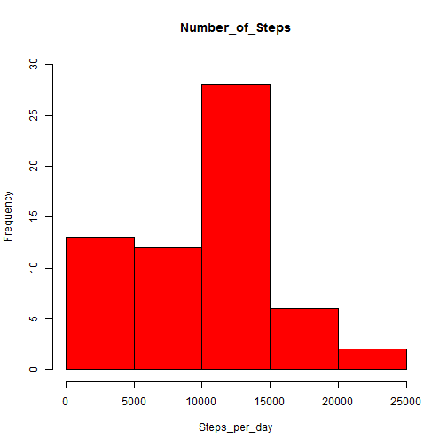
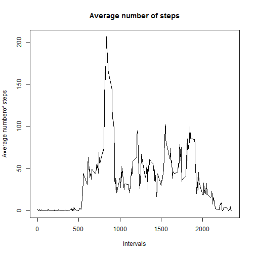
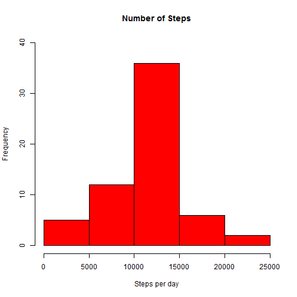
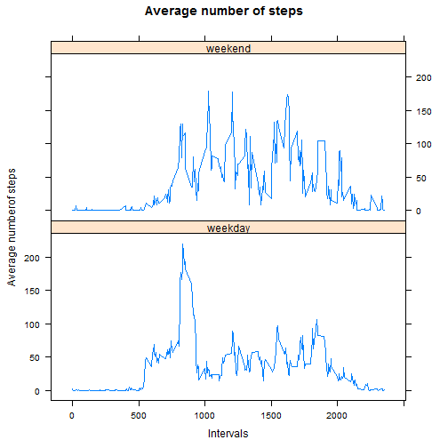

#Peer Assesment 1

##Code for rxeading in the dataset and/or processing the data

###Code for reading in the dataset

```r
data<-read.csv("activity.csv")
as.data.frame(data)
```

```
##       steps       date interval
## 1        NA 2012-10-01        0
## 2        NA 2012-10-01        5
## 3        NA 2012-10-01       10
## 4        NA 2012-10-01       15
## 5        NA 2012-10-01       20
## 6        NA 2012-10-01       25
## 7        NA 2012-10-01       30
## 8        NA 2012-10-01       35
## 9        NA 2012-10-01       40
## 10       NA 2012-10-01       45
## 11       NA 2012-10-01       50
## 12       NA 2012-10-01       55
## 13       NA 2012-10-01      100
## 14       NA 2012-10-01      105
## 15       NA 2012-10-01      110
## 16       NA 2012-10-01      115
## 17       NA 2012-10-01      120
## 18       NA 2012-10-01      125
## 19       NA 2012-10-01      130
## 20       NA 2012-10-01      135
## 21       NA 2012-10-01      140
## 22       NA 2012-10-01      145
## 23       NA 2012-10-01      150
## 24       NA 2012-10-01      155
## 25       NA 2012-10-01      200
## 26       NA 2012-10-01      205
## 27       NA 2012-10-01      210
## 28       NA 2012-10-01      215
## 29       NA 2012-10-01      220
## 30       NA 2012-10-01      225
## 31       NA 2012-10-01      230
## 32       NA 2012-10-01      235
## 33       NA 2012-10-01      240
## 34       NA 2012-10-01      245
## 35       NA 2012-10-01      250
## 36       NA 2012-10-01      255
## 37       NA 2012-10-01      300
## 38       NA 2012-10-01      305
## 39       NA 2012-10-01      310
## 40       NA 2012-10-01      315
## 41       NA 2012-10-01      320
## 42       NA 2012-10-01      325
## 43       NA 2012-10-01      330
## 44       NA 2012-10-01      335
## 45       NA 2012-10-01      340
## 46       NA 2012-10-01      345
## 47       NA 2012-10-01      350
## 48       NA 2012-10-01      355
## 49       NA 2012-10-01      400
## 50       NA 2012-10-01      405
## 51       NA 2012-10-01      410
## 52       NA 2012-10-01      415
## 53       NA 2012-10-01      420
## 54       NA 2012-10-01      425
## 55       NA 2012-10-01      430
## 56       NA 2012-10-01      435
## 57       NA 2012-10-01      440
## 58       NA 2012-10-01      445
## 59       NA 2012-10-01      450
## 60       NA 2012-10-01      455
## 61       NA 2012-10-01      500
## 62       NA 2012-10-01      505
## 63       NA 2012-10-01      510
## 64       NA 2012-10-01      515
## 65       NA 2012-10-01      520
## 66       NA 2012-10-01      525
## 67       NA 2012-10-01      530
## 68       NA 2012-10-01      535
## 69       NA 2012-10-01      540
## 70       NA 2012-10-01      545
## 71       NA 2012-10-01      550
## 72       NA 2012-10-01      555
## 73       NA 2012-10-01      600
## 74       NA 2012-10-01      605
## 75       NA 2012-10-01      610
## 76       NA 2012-10-01      615
## 77       NA 2012-10-01      620
## 78       NA 2012-10-01      625
## 79       NA 2012-10-01      630
## 80       NA 2012-10-01      635
## 81       NA 2012-10-01      640
## 82       NA 2012-10-01      645
## 83       NA 2012-10-01      650
## 84       NA 2012-10-01      655
## 85       NA 2012-10-01      700
## 86       NA 2012-10-01      705
## 87       NA 2012-10-01      710
## 88       NA 2012-10-01      715
## 89       NA 2012-10-01      720
## 90       NA 2012-10-01      725
## 91       NA 2012-10-01      730
## 92       NA 2012-10-01      735
## 93       NA 2012-10-01      740
## 94       NA 2012-10-01      745
## 95       NA 2012-10-01      750
## 96       NA 2012-10-01      755
## 97       NA 2012-10-01      800
## 98       NA 2012-10-01      805
## 99       NA 2012-10-01      810
## 100      NA 2012-10-01      815
## 101      NA 2012-10-01      820
## 102      NA 2012-10-01      825
## 103      NA 2012-10-01      830
## 104      NA 2012-10-01      835
## 105      NA 2012-10-01      840
## 106      NA 2012-10-01      845
## 107      NA 2012-10-01      850
## 108      NA 2012-10-01      855
## 109      NA 2012-10-01      900
## 110      NA 2012-10-01      905
## 111      NA 2012-10-01      910
## 112      NA 2012-10-01      915
## 113      NA 2012-10-01      920
## 114      NA 2012-10-01      925
## 115      NA 2012-10-01      930
## 116      NA 2012-10-01      935
## 117      NA 2012-10-01      940
## 118      NA 2012-10-01      945
## 119      NA 2012-10-01      950
## 120      NA 2012-10-01      955
## 121      NA 2012-10-01     1000
## 122      NA 2012-10-01     1005
## 123      NA 2012-10-01     1010
## 124      NA 2012-10-01     1015
## 125      NA 2012-10-01     1020
## 126      NA 2012-10-01     1025
## 127      NA 2012-10-01     1030
## 128      NA 2012-10-01     1035
## 129      NA 2012-10-01     1040
## 130      NA 2012-10-01     1045
## 131      NA 2012-10-01     1050
## 132      NA 2012-10-01     1055
## 133      NA 2012-10-01     1100
## 134      NA 2012-10-01     1105
## 135      NA 2012-10-01     1110
## 136      NA 2012-10-01     1115
## 137      NA 2012-10-01     1120
## 138      NA 2012-10-01     1125
## 139      NA 2012-10-01     1130
## 140      NA 2012-10-01     1135
## 141      NA 2012-10-01     1140
## 142      NA 2012-10-01     1145
## 143      NA 2012-10-01     1150
## 144      NA 2012-10-01     1155
## 145      NA 2012-10-01     1200
## 146      NA 2012-10-01     1205
## 147      NA 2012-10-01     1210
## 148      NA 2012-10-01     1215
## 149      NA 2012-10-01     1220
## 150      NA 2012-10-01     1225
## 151      NA 2012-10-01     1230
## 152      NA 2012-10-01     1235
## 153      NA 2012-10-01     1240
## 154      NA 2012-10-01     1245
## 155      NA 2012-10-01     1250
## 156      NA 2012-10-01     1255
## 157      NA 2012-10-01     1300
## 158      NA 2012-10-01     1305
## 159      NA 2012-10-01     1310
## 160      NA 2012-10-01     1315
## 161      NA 2012-10-01     1320
## 162      NA 2012-10-01     1325
## 163      NA 2012-10-01     1330
## 164      NA 2012-10-01     1335
## 165      NA 2012-10-01     1340
## 166      NA 2012-10-01     1345
## 167      NA 2012-10-01     1350
## 168      NA 2012-10-01     1355
## 169      NA 2012-10-01     1400
## 170      NA 2012-10-01     1405
## 171      NA 2012-10-01     1410
## 172      NA 2012-10-01     1415
## 173      NA 2012-10-01     1420
## 174      NA 2012-10-01     1425
## 175      NA 2012-10-01     1430
## 176      NA 2012-10-01     1435
## 177      NA 2012-10-01     1440
## 178      NA 2012-10-01     1445
## 179      NA 2012-10-01     1450
## 180      NA 2012-10-01     1455
## 181      NA 2012-10-01     1500
## 182      NA 2012-10-01     1505
## 183      NA 2012-10-01     1510
## 184      NA 2012-10-01     1515
## 185      NA 2012-10-01     1520
## 186      NA 2012-10-01     1525
## 187      NA 2012-10-01     1530
## 188      NA 2012-10-01     1535
## 189      NA 2012-10-01     1540
## 190      NA 2012-10-01     1545
## 191      NA 2012-10-01     1550
## 192      NA 2012-10-01     1555
## 193      NA 2012-10-01     1600
## 194      NA 2012-10-01     1605
## 195      NA 2012-10-01     1610
## 196      NA 2012-10-01     1615
## 197      NA 2012-10-01     1620
## 198      NA 2012-10-01     1625
## 199      NA 2012-10-01     1630
## 200      NA 2012-10-01     1635
## 201      NA 2012-10-01     1640
## 202      NA 2012-10-01     1645
## 203      NA 2012-10-01     1650
## 204      NA 2012-10-01     1655
## 205      NA 2012-10-01     1700
## 206      NA 2012-10-01     1705
## 207      NA 2012-10-01     1710
## 208      NA 2012-10-01     1715
## 209      NA 2012-10-01     1720
## 210      NA 2012-10-01     1725
## 211      NA 2012-10-01     1730
## 212      NA 2012-10-01     1735
## 213      NA 2012-10-01     1740
## 214      NA 2012-10-01     1745
## 215      NA 2012-10-01     1750
## 216      NA 2012-10-01     1755
## 217      NA 2012-10-01     1800
## 218      NA 2012-10-01     1805
## 219      NA 2012-10-01     1810
## 220      NA 2012-10-01     1815
## 221      NA 2012-10-01     1820
## 222      NA 2012-10-01     1825
## 223      NA 2012-10-01     1830
## 224      NA 2012-10-01     1835
## 225      NA 2012-10-01     1840
## 226      NA 2012-10-01     1845
## 227      NA 2012-10-01     1850
## 228      NA 2012-10-01     1855
## 229      NA 2012-10-01     1900
## 230      NA 2012-10-01     1905
## 231      NA 2012-10-01     1910
## 232      NA 2012-10-01     1915
## 233      NA 2012-10-01     1920
## 234      NA 2012-10-01     1925
## 235      NA 2012-10-01     1930
## 236      NA 2012-10-01     1935
## 237      NA 2012-10-01     1940
## 238      NA 2012-10-01     1945
## 239      NA 2012-10-01     1950
## 240      NA 2012-10-01     1955
## 241      NA 2012-10-01     2000
## 242      NA 2012-10-01     2005
## 243      NA 2012-10-01     2010
## 244      NA 2012-10-01     2015
## 245      NA 2012-10-01     2020
## 246      NA 2012-10-01     2025
## 247      NA 2012-10-01     2030
## 248      NA 2012-10-01     2035
## 249      NA 2012-10-01     2040
## 250      NA 2012-10-01     2045
## 251      NA 2012-10-01     2050
## 252      NA 2012-10-01     2055
## 253      NA 2012-10-01     2100
## 254      NA 2012-10-01     2105
## 255      NA 2012-10-01     2110
## 256      NA 2012-10-01     2115
## 257      NA 2012-10-01     2120
## 258      NA 2012-10-01     2125
## 259      NA 2012-10-01     2130
## 260      NA 2012-10-01     2135
## 261      NA 2012-10-01     2140
## 262      NA 2012-10-01     2145
## 263      NA 2012-10-01     2150
## 264      NA 2012-10-01     2155
## 265      NA 2012-10-01     2200
## 266      NA 2012-10-01     2205
## 267      NA 2012-10-01     2210
## 268      NA 2012-10-01     2215
## 269      NA 2012-10-01     2220
## 270      NA 2012-10-01     2225
## 271      NA 2012-10-01     2230
## 272      NA 2012-10-01     2235
## 273      NA 2012-10-01     2240
## 274      NA 2012-10-01     2245
## 275      NA 2012-10-01     2250
## 276      NA 2012-10-01     2255
## 277      NA 2012-10-01     2300
## 278      NA 2012-10-01     2305
## 279      NA 2012-10-01     2310
## 280      NA 2012-10-01     2315
## 281      NA 2012-10-01     2320
## 282      NA 2012-10-01     2325
## 283      NA 2012-10-01     2330
## 284      NA 2012-10-01     2335
## 285      NA 2012-10-01     2340
## 286      NA 2012-10-01     2345
## 287      NA 2012-10-01     2350
## 288      NA 2012-10-01     2355
## 289       0 2012-10-02        0
## 290       0 2012-10-02        5
## 291       0 2012-10-02       10
## 292       0 2012-10-02       15
## 293       0 2012-10-02       20
## 294       0 2012-10-02       25
## 295       0 2012-10-02       30
## 296       0 2012-10-02       35
## 297       0 2012-10-02       40
## 298       0 2012-10-02       45
## 299       0 2012-10-02       50
## 300       0 2012-10-02       55
## 301       0 2012-10-02      100
## 302       0 2012-10-02      105
## 303       0 2012-10-02      110
## 304       0 2012-10-02      115
## 305       0 2012-10-02      120
## 306       0 2012-10-02      125
## 307       0 2012-10-02      130
## 308       0 2012-10-02      135
## 309       0 2012-10-02      140
## 310       0 2012-10-02      145
## 311       0 2012-10-02      150
## 312       0 2012-10-02      155
## 313       0 2012-10-02      200
## 314       0 2012-10-02      205
## 315       0 2012-10-02      210
## 316       0 2012-10-02      215
## 317       0 2012-10-02      220
## 318       0 2012-10-02      225
## 319       0 2012-10-02      230
## 320       0 2012-10-02      235
## 321       0 2012-10-02      240
## 322       0 2012-10-02      245
## 323       0 2012-10-02      250
## 324       0 2012-10-02      255
## 325       0 2012-10-02      300
## 326       0 2012-10-02      305
## 327       0 2012-10-02      310
## 328       0 2012-10-02      315
## 329       0 2012-10-02      320
## 330       0 2012-10-02      325
## 331       0 2012-10-02      330
## 332       0 2012-10-02      335
## 333       0 2012-10-02      340
##  [ reached getOption("max.print") -- omitted 17235 rows ]
```

###Process/transform the data (if necessary) into a format suitable for your analysis

```r
library(plyr)
library(dplyr)

ddply(data, .(date), summarize,  steps=sum(steps))
```

```
##          date steps
## 1  2012-10-01    NA
## 2  2012-10-02   126
## 3  2012-10-03 11352
## 4  2012-10-04 12116
## 5  2012-10-05 13294
## 6  2012-10-06 15420
## 7  2012-10-07 11015
## 8  2012-10-08    NA
## 9  2012-10-09 12811
## 10 2012-10-10  9900
## 11 2012-10-11 10304
## 12 2012-10-12 17382
## 13 2012-10-13 12426
## 14 2012-10-14 15098
## 15 2012-10-15 10139
## 16 2012-10-16 15084
## 17 2012-10-17 13452
## 18 2012-10-18 10056
## 19 2012-10-19 11829
## 20 2012-10-20 10395
## 21 2012-10-21  8821
## 22 2012-10-22 13460
## 23 2012-10-23  8918
## 24 2012-10-24  8355
## 25 2012-10-25  2492
## 26 2012-10-26  6778
## 27 2012-10-27 10119
## 28 2012-10-28 11458
## 29 2012-10-29  5018
## 30 2012-10-30  9819
## 31 2012-10-31 15414
## 32 2012-11-01    NA
## 33 2012-11-02 10600
## 34 2012-11-03 10571
## 35 2012-11-04    NA
## 36 2012-11-05 10439
## 37 2012-11-06  8334
## 38 2012-11-07 12883
## 39 2012-11-08  3219
## 40 2012-11-09    NA
## 41 2012-11-10    NA
## 42 2012-11-11 12608
## 43 2012-11-12 10765
## 44 2012-11-13  7336
## 45 2012-11-14    NA
## 46 2012-11-15    41
## 47 2012-11-16  5441
## 48 2012-11-17 14339
## 49 2012-11-18 15110
## 50 2012-11-19  8841
## 51 2012-11-20  4472
## 52 2012-11-21 12787
## 53 2012-11-22 20427
## 54 2012-11-23 21194
## 55 2012-11-24 14478
## 56 2012-11-25 11834
## 57 2012-11-26 11162
## 58 2012-11-27 13646
## 59 2012-11-28 10183
## 60 2012-11-29  7047
## 61 2012-11-30    NA
```

```r
data2<- ddply(data, .(date), summarize,  steps=sum(steps,na.rm = TRUE))
```
##Histogram of the total number of steps taken each day

```r
hist(data2$steps, col ="red",main ="Number_of_Steps",xlab="Steps_per_day",ylim=c(0,30))
```



##Mean and median number of steps taken each day

```r
mean(data2$steps, na.rm = TRUE)
```

```
## [1] 9354.23
```

```r
median(data2$steps, na.rm = TRUE)
```

```
## [1] 10395
```
##Time series plot of the average number of steps taken

```r
data3<- ddply(data, .(interval), summarize,  steps=mean(steps,na.rm = TRUE))

plot(data3$interval, data3$steps,type="l", main="Average number of steps", xlab = "Intervals", ylab = "Average numberof steps") 
```



##The 5-minute interval that, on average, contains the maximum number of steps

```r
data3[which.max(data3$steps),1]
```

```
## [1] 835
```
##Code to describe and show a strategy for imputing missing data

####Calculate and report the total number of missing values in the dataset (i.e. the total number of rows with NA)

```r
complete<-data[complete.cases(data),]
    
NArows<- nrow(data)-nrow(complete)
```
####Devise a strategy for filling in all of the missing values in the dataset. 

```r
miss<-data[!complete.cases(data),]
```
- adding column with interval as replacing values for NA and then select all columns but the NAs, i.e only columns 4,2,3

```r
miss2=left_join(miss,data3,'interval') 

miss3<- miss2[,c(4,2,3)]
colnames(miss3) <- c("steps","date", "interval")
```
- integrate the complete data with the replaced missing values

```r
data4<- rbind(miss3,complete)
```
##Histogram of the total number of steps taken each day after missing values are imputed

```r
data5<- ddply(data4, .(date), summarize,  steps=sum(steps))
hist(data5$steps, col ="red",main ="Number of Steps",xlab="Steps per day",ylim=c(0,40))  
```


##Panel plot comparing the average number of steps taken per 5-minute interval across weekdays and weekends

###Create a new factor variable in the dataset with two levels - "weekday" and "weekend" indicating whether a given date is a weekday or weekend day.

```r
weekday<-weekdays(as.Date(data5$date))
weekday2<-ifelse(weekday=="s?bado"|weekday=="domingo","weekend","weekday")
```
###Make a panel plot containing a time series plot

```r
a<-as.data.frame(weekday)
b<-as.data.frame(weekday2)
c<-as.data.frame(data5$date)
data6<-cbind(a,b,c)
colnames(data6) <- c("weekday","daytype", "date")

data7=left_join(data4,data6,'date') 

data8<- ddply(data7, .(interval,daytype), summarize,  steps=mean(steps))
require(lattice)
xyplot(steps ~ interval | daytype, data = data8, type = "l", layout = c(1, 2), main="Average number of steps", xlab = "Intervals", ylab = "Average numberof steps")
```



